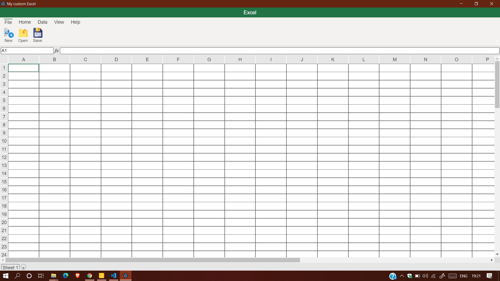
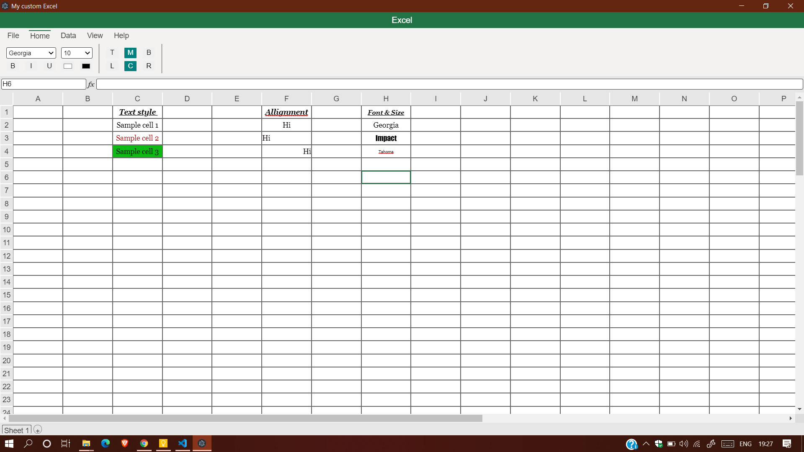

# Excel-Clone
Inspired from MSExcel. Uses topological-sort to implement dependencies among cells and for waterfall effect.

# Prerequisites
Install puppeteer `npm install electron`

# Features :
  - Text Alignment
  - Font & Size.
  - Formula
  - Cell Dependencies
  - Colors
  - Custom save format.
  - Effects retrival.
 
# Screenshots :

Blank sheet : 

Demo Sheet : 

